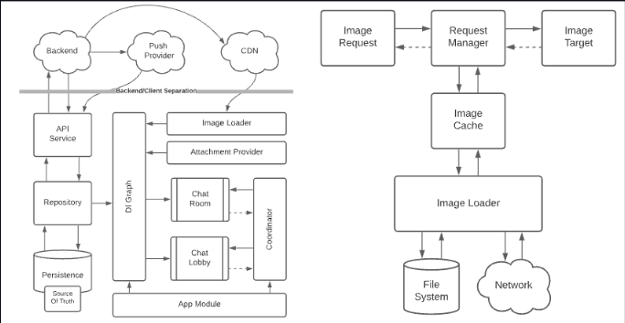
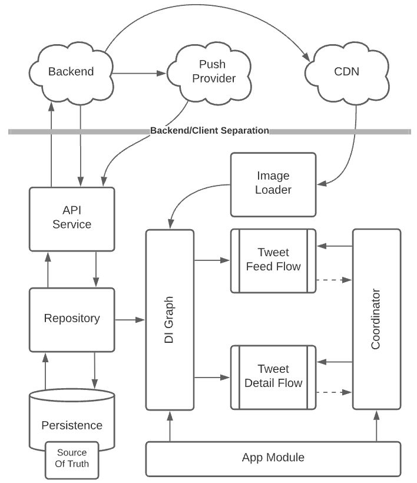

# System Design

- <a href="imageloading/README.md">Image Loading</a>
- <a href="filedownloader/README.md">File Downloader</a>
- <a href="twitter/README.md">Twitter</a>
- <a href="booking/README.md">Booking.com</a>

## General
- <a href="security.md">Security</a>
- <a href="optimization.md">Optimization</a>

## Stages
- Defining Task
  - Client Side?
  - Client Side + API? (json scheme)
  - Client Side + API + BE? (backend architecture)
- Functional Requirement
  - Create, edit, delete?
  - Infinite load more
- Non functional requirement
  - Offline support
  - Optimization battery usage
- Out of scope
  - Authentication
  - Analytics

## Possiblity Questions
- Is users network that use application is so fast or quite slow?

## High Level System Design
High-level system design refers to the process of creating an abstract representation of a system that captures its key components, their interactions, and the overall structure. It's quite similar with <a href="https://c4model.com/">c4 model</a> created by Simon Brown.

- Should you design high level system design in interview?
  - It's depends on recruiter, you can ask if he want high level system design first.
  - If the recruiter up to you or what's your recommendation, here's pro & cons
    - pros: 
      - each high level component can work with different dev & not blocking to anyone because it can separate into module or package or folder.
      - the conversation will clear because we separate to some topics in each session.
    - cons:
      - Take time in interview
  - My preference is if the application is small like 1 feature don't need high level ex: Image loader library, recipe app, file downloader library.
  - If application quite large like whatsapp, spotify, uber, we need to make high level design to make sure our interview is straightforward and have topics in each section because we can split design to some flow ex for whatsapp: list chat flow, chat flow, phone call flow, group chat flow etc.

  
  

## Uber System Design

## TODO
- https://gist.github.com/atierian/610538f39a4844881e20b673f4c8e8dc
- https://medium.com/@anandgaur2207/android-system-design-interview-questions-and-answers-f6e713bd15de
- https://medium.com/@YodgorbekKomilo/system-design-preparation-guide-for-medium-level-android-developers-dbeec85aeec4
- https://medium.com/@engineervishvnath/android-system-design-for-interviews-crafting-a-google-photos-like-app-971dfb85ae59
- https://medium.com/@engineervishvnath
