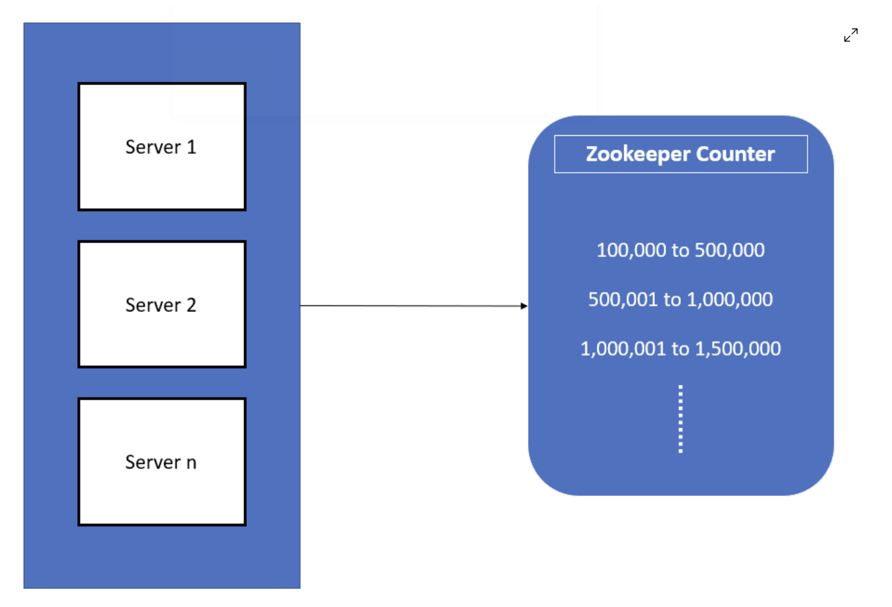
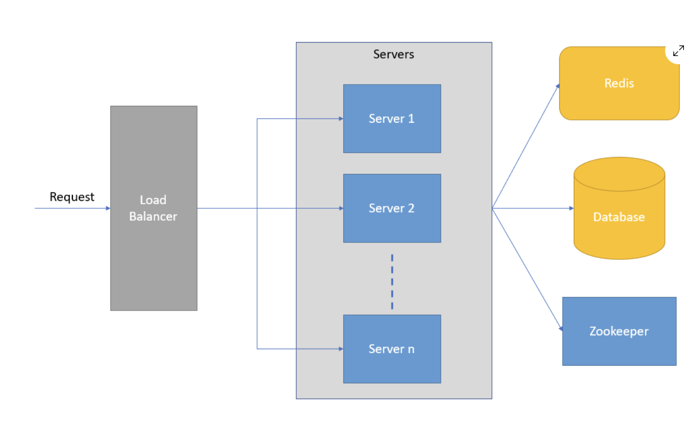

# URL Shortener System Design

## How To Generate Random String
There are various hashing or encoding algorithms which we can be used for this purpose. Base62 and MD5 are the popular ones. Both base62 and MD5 produces output consisting of 62 characters combinations (a-z, A-Z and 0-9). Base62 takes a integer input and MD5 takes string as the input and generates a random string output. For base62 algorithm, we need to convert our long URL string into an integer first and then pass it to the algorithm and for MD5 algorithm we can directly pass the long URL as input.

### MD5
MD5 algorithm takes a string as input and produces a fixed length output. For each input string MD5 algorithm mostly produces unique output, there is still a chance of it producing the same output for two different inputs, but this is very rare. But the thing with MD5 algorithm is that it produces a really long output. This is a problem because we have a restriction of 7 characters for our random string. We can solve this problem by taking only a part of the output produced by MD5 algorithm, say for instance we consider only the first 7 characters of the MD5 output. But there is a problem with this approach as well. The chances of collision increases if we consider only the first 7 characters of the MD5 output, meaning for different long URLs we might end up with the same 7 characters as output which is not what we want. For each long URL we always need to have a unique set of 7 characters in the short URL or it will result in data corruption.

### Base62
Base62 also produces an output consisting of a combination of same 62 letters as md5. Base62 takes integer type as input. So we need to first convert the long URL to a random number then pass this random number to the base62 algorithm.

Can we use the output of base62 as is and store it into the database? The answer is no because, if you notice we first convert the long URL to random number and then pass it to base62 algorithm. So there is a possibility that we end up getting the same random number for different long URLs.

This means, each time we generate random characters using base62, we first need to check if that data is already present in database, if yes we regenerate the random number and again pass it to base62 algorithm. We repeat this until we obtain a unique random string and then store it in the database. Now this is clearly not an efficient approach.

How can we make this work efficiently? If you look at the problem at its core, the reason why we end up with duplicate random string is because we pass duplicate random number to base62 algorithm. If we can somehow pass a unique random number to base62 every time which can avoid this problem completely.

### Counter Based Approach

The idea is to make use of a counter instead of generating the random number each time. When the server gets a request to convert a long URL to short URL, it first talks to the counter to get a count value, this value is then passed to the base62 algorithm to generate random string. Making use of a counter to get the integer value ensures that the number we get will always be unique by default because after every request the counter increments its value.

#### Challenge
- What if server that has counter instance down?
- What if the counter runs out of numbers?

#### Solution
If we plan to implement the counter ourselves, we would have to handle all these complexities ourselves and for that reason we would be making use of a third party service called <code>Apache Zookeeper</code> which takes care of all these complexities for us so that we just have to focus on the core business logic.

  
Zookeeper is an open-source distributed service which can be used for maintaining configurations, managing co-ordination between services in a cluster, distributed synchronization, naming nodes in a cluster and many other things.

If a server runs out of counter range assigned to it, zookeeper assigns it a new range. Zookeeper is a distributed service, if the counter node fails, zookeeper automatically spins up a new counter instance. Also as we get more users using our service, we can add as many servers as we want to handle this load, zookeeper takes care of assigning and maintaining the counter values for all these servers.

## Database
We only need to store the short URL to long URL mapping. When the user gives us the short URL, we just need to get the long URL using the 7 character random string in the short URL. We do not need to perform any relational queries or joins to store or get this data. So we do not need a SQL database. As far as No-SQL databases are concerned, there are various types of No-SQL databases like document database, graph database, column database, key-value database etc. As we can clearly see, our service uses a simple key value mapping. Therefore we can go with a <code>No-SQL key-value pair database</code>. Some of the popular ones are Amazon DynamoDB, Oracle NoSQL Database, InfinityDB, Aerospike etc.

## Scaling
Most popular cloud solutions provide the auto scaling feature. If we deploy our service to a popular cloud provider like AWS we can easily leverage its auto scaling capability. Once integrated, it will automatically increase or decrease the number of active server instances depending on the number of requests we get.

## Final
  
In above image we can see redis, redis use as caching for LFU (Least Frequently Used).